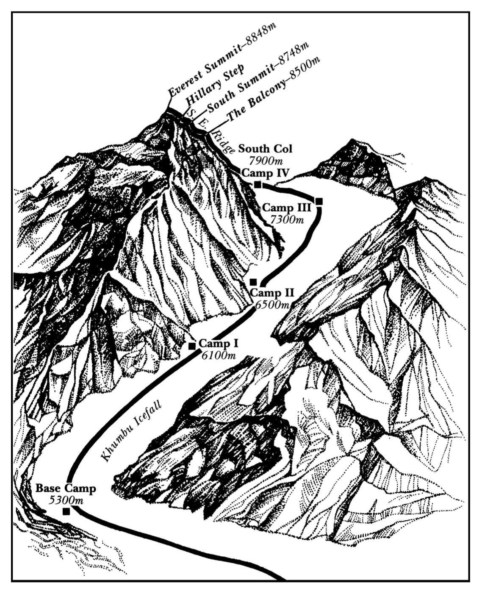

# Climbing Mt. Everest 🏔️

**NOTE:** This game is inspired by real events and challenges faced by climbers on Mount Everest. I learned about these in CIS 5460, Engineering Entrepreneurship II, where we had to do a Mt. Everest Simulation and read a case study. This is the route to the summit (Mount Everest Route – South Col Route) that I based the game on: 



## Explanations

**What locations/rooms does your game have?**

1. Basecamp
2. Camp I
3. Camp II
4. Camp III
5. Camp IV
6. Sherpa Tent
7. South Summit
8. Hillary Step
9. Summit

**What items does your game have?**

1. Map
2. Weather Radio
3. Oxygen Tank (x9)
4. Rope

**Explain how your code is designed. In particular, describe how you used structs or enums, as well as protocols.**

1. `Location` struct: Represents each location in the game, containing properties like name, description, exits, and items.
2. `Item` struct: Represents items that can be picked up and used by the player.
3. `GameState` enum: Tracks the player's progress through the game (e.g., atBasecamp, onMountain, atSummit, descending, gameOver).
4. `EverestGame` struct: The main game struct that implements the `AdventureGame` protocol.

The `GameObject` protocol is used to provide a common interface for both `Location` and `Item` structs, ensuring they both have `name` and `description` properties.

**How do you use optionals in your program?**

1. In the `handle` function, the `argument` is an optional `String?` that may or may not contain additional input from the user.
2. When accessing locations and items, optionals are used with dictionary lookups and array searches, using `if let` and optional chaining to safely unwrap values.
3. The `guard let` statement in the `move` function uses optionals to ensure valid locations and exits exist before allowing movement.

**What extra credit features did you implement, if any?**

* Rich Text Implementation: Added colored and formatted text for key game messages, including:
  - **Welcome message:** Blue, large serif font
  - **Critical warnings and game over messages:** Red, large serif font
  - **New information messages:** Yellow, serif font, size 13. (e.g. "Your inventory is empty")
  - **Narrative messages:** Orange, serif font, size 13. (e.g. "It shows the route through the camps")
  - **Action messages:** Blue, serif font, size 13. (e.g. "You use an oxygen tank", "You check the weather conditions")
  - **Summit Achievement + Victory message:** Green, large serif font!

This implementation enhances the visual appeal and readability of the game, making important information stand out to the player.

## Endings

### Ending 1: Success

```
take map
north (Camp I)
take weather radio
use weather radio
north (Camp II)
north (Camp III)
take oxygen tank
take oxygen tank
take oxygen tank
use weather radio
north (Camp IV)
use oxygen tank
west (Sherpa Tent)
take rope
take oxygen tank
take oxygen tank
use weather radio
east (Camp IV)
use oxygen tank
north (South Summit)
use oxygen tank
east (Hillary Step)
use weather radio
north (Summit!)
use oxygen tank
south (Hillary Step)
use oxygen tank
use weather radio
west (South Summit)
take oxygen tank
take oxygen tank
use oxygen tank
south (Camp IV)
use oxygen tank
west (Sherpa Tent)
take oxygen tank
take oxygen tank
use weather radio
east (Camp IV)
use oxygen tank
south (Camp III)
use weather radio
south (Camp II)
south (Camp I)
use weather radio
south (Basecamp!)
```

### Ending 2: Failure - Avalanche (just one example. If you don't [use weather radio] at Camp I, III, Sherpa Tent, or Hillary Step, you die)

```
take map
north
north
```

### Ending 3: Failure - Running out of Oxygen (just one example)

```
take map
north (Camp I)
take weather radio
use weather radio
north (Camp II)
north (Camp III)
take oxygen tank
use weather radio
north (Camp IV)
use oxygen tank
west (Sherpa Tent)
use weather radio
east (Camp IV)
```

### Ending 4: Failure - Falling at Hillary Step (because didn't take rope)

```
take map
north (Camp I)
take weather radio
use weather radio
north (Camp II)
north (Camp III)
take oxygen tank
take oxygen tank
take oxygen tank
use weather radio
north (Camp IV)
use oxygen tank
west (Sherpa Tent)
take oxygen tank
take oxygen tank
use weather radio
east (Camp IV)
use oxygen tank
north (South Summit)
use oxygen tank
east (Hillary Step)
use weather radio
north (Summit!)
use oxygen tank
south (Hillary Step)
```

### Ending 5: Failure - Exhaustion during descent (because didn't stop at Sherpa Tent)

```
take map
north (Camp I)
take weather radio
use weather radio
north (Camp II)
north (Camp III)
take oxygen tank
take oxygen tank
take oxygen tank
use weather radio
north (Camp IV)
use oxygen tank
west (Sherpa Tent)
take rope
take oxygen tank
take oxygen tank
use weather radio
east (Camp IV)
use oxygen tank
north (South Summit)
use oxygen tank
east (Hillary Step)
use weather radio
north (Summit!)
use oxygen tank
south (Hillary Step)
use oxygen tank
use weather radio
west (South Summit)
take oxygen tank
take oxygen tank
use oxygen tank
south (Camp IV)
use oxygen tank
south
```

## Additional Resources

For more information about the 1996 Mount Everest disaster and the complexities of high-altitude climbing, you can refer to the case study: 'Roberto, M. A., & Carioggia, G. M. (2003). Mount Everest--1996. Harvard Business School Case, 303-061.'

You can access the PDF of this case study here: [Mount Everest - 1996 (PDF)](https://services.hbsp.harvard.edu/api/courses/1204452/items/303061-PDF-ENG/sclinks/3b1f40a0606d30ba3abbd0c80117341a)

Please note that access to this resource may require appropriate permissions or subscriptions.
